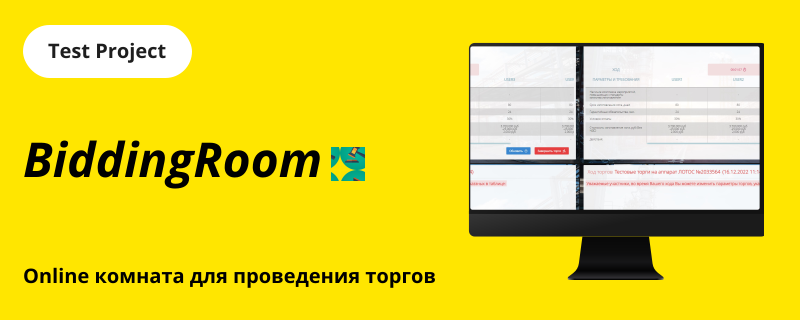

<p align="center">
  
</p>

# *BiddingRoom*

## Содержание

* [О проекте](#about)
* [Процесс разработки](#process)
* [Staсk технологий](#stack)
* [Запуск проекта](#launch)
* [Функционал проекта](#functionality)
* [Структура проекта](#structure)
* [Полученные опыт и навыки](#experience)

<a name="about"></a>
### О проекте
Цель проекта: реализация online комнаты для проевдения торгов между участниками рынка на конкурсной основе. Суть проекта: предоставить каждому участнику равное количство времени для подачи предложения. Результат торгов будет определён, исходя из цены предложения.

<a name="process"></a>
### Процесс разработки
* 📌 — Планирование проекта
* 📌 — Наброски макета
* 🛠 — Вёрстка
* 🛠 — Разработка логики
* ☑️ — Сборка продукта
* 🚀 — Публикация
* ⭕ — Улучшение продукта
* ⭕ — Доработка функционала участников

<a name="stack"></a>
### Staсk технологий
* JavaScript - язык программирования
* [React](https://reactjs.org) — библиотека для построения UI
* [Redux](https://redux.js.org) — библиотека для управления BLL

<a name="launch"></a>
### Запуск проекта

Доступные команды:

##### `npm i`
Скрипт для начальной инициализации и установки зависимостей

##### `npm start`
Локальный запуск проекта по адресу **`localhost:3000`** в режиме разработки

##### `npm run deploy`
Сборка production-версии проекта. Результат сборки попадёт в папку `./build`


<a name="functionality"></a>
### Функционал проекта
- 🕐...🕐 Синхронная работа таймера между пользователями
- 👤 2-х минутный интервал на ход для участника
- ✅Таймер работает независимо от наличия участников в комнате


<a name="structure"></a>
### Структура проекта

```
app                      
├── public                      - публичные файлы, не требующие сборки
│                     
└── src                         - основной каталог разработки               
    ├── assets                  - общие файлы, касающиеся UI
    ├── components              - вспомогательные компоненты UI
    ├── features                - комбинированные компоненты
    ├── pages                   - компоненты страниц приложения
    ├── routers                 - навигация по приложению
    ├── stores                  - хранилище данных
    ├── utils                   - утилиты и функции
    └── index.js                - точка входа в приложение
```

<a name="experience"></a>
### Полученные опыт и навыки
- ⚡️ Синхронизация таймера для каждого пользователя
- ⚡️ hooks React
- ⚡️ HOC React
- ⚡️ Интерфейсные события
- ⚡️ Компонентный подход к разработке